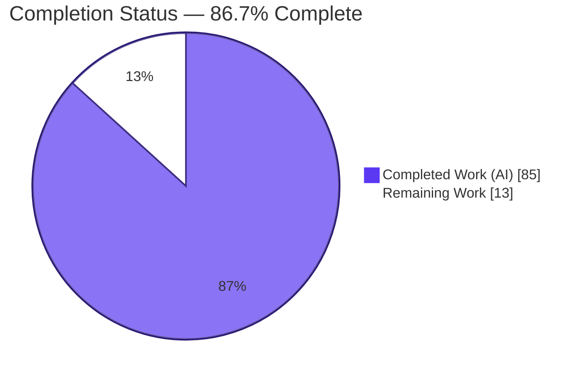
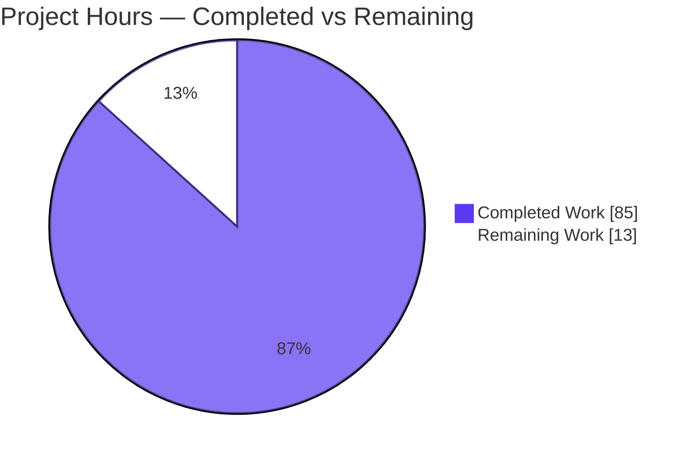
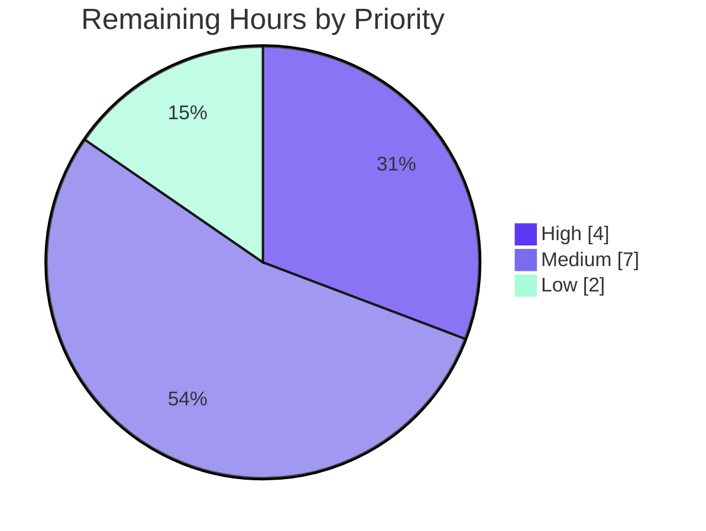
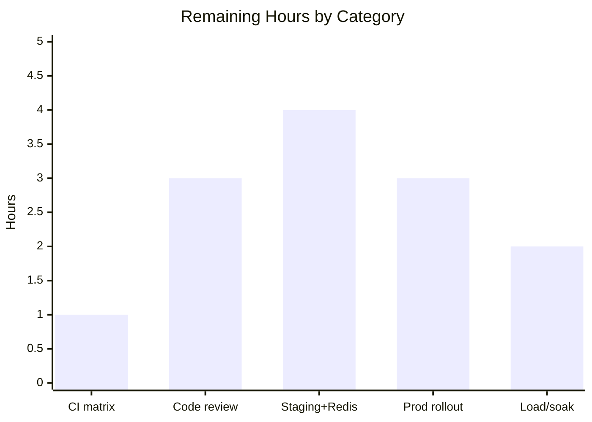

# Blitzy Project Guide
## Opt-In, Redis-Backed Global (Cross-Worker) Rate Limiter for Celery

---

## 1. Executive Summary

### 1.1 Project Overview

This project adds an **opt-in, Redis-backed global rate limiter** to the Celery distributed task queue (v5.6.2). Today a task's configured `rate_limit` is enforced independently inside each worker process, so with N workers a task limited to `R/s` can run at up to `N x R/s` in aggregate. The feature introduces a single shared token bucket — coordinated atomically through Redis — so that a task configured at rate `R` executes at an aggregate throughput `<= R` across all workers for any worker count `N >= 1`, when enabled. It is default-off and byte-for-byte backward compatible when disabled. Target users are Celery operators who must respect hard third-party API or resource quotas across a horizontally-scaled worker fleet.

### 1.2 Completion Status

The project is **86.7% complete** on an AAP-scoped, hours-based basis. All feature code, tests, documentation, and rule-mandated deliverables are implemented and independently verified; the remaining 13 hours are human path-to-production activities (CI wiring, code review, staging/production rollout, and load testing).



| Metric | Value |
|--------|-------|
| **Total Hours** | 98 |
| **Completed Hours (AI + Manual)** | 85 (85 AI + 0 Manual) |
| **Remaining Hours** | 13 |
| **Percent Complete** | **86.7%** |

> Completion % = Completed / (Completed + Remaining) = 85 / (85 + 13) = 85 / 98 = **86.7%**

### 1.3 Key Accomplishments

- ✅ **New isolated limiter module** `celery/worker/global_ratelimit.py` (362 lines) — Redis client manager, atomic Lua token-acquisition script (uses the Redis `TIME` server clock to avoid worker clock skew), and a `GlobalTokenBucket` that mirrors the `kombu.utils.limits.TokenBucket` interface.
- ✅ **Single minimal gating hook** — only `bucket_for_task()` in `consumer.py` was modified (+12 lines); `strategy.py` and the entire deferral/retry loop are byte-for-byte unchanged.
- ✅ **Headline success criterion proven** — live-Redis integration test with **N=2 spawned worker processes** shows aggregate executed count `<= ~R` AND `< N x R` (a single shared budget that does not scale with worker count).
- ✅ **Fail-open safety** — on any Redis error the limiter logs a warning and falls back to the local per-worker `TokenBucket`; no task is ever blocked, dropped, rejected, or dead-lettered.
- ✅ **Zero new dependencies** — redis-py (6.4.0) is reused transitively via `kombu[redis]`; `setup.py` and `requirements/` are unchanged (AAP hard constraint satisfied).
- ✅ **Default-off backward compatibility** — `worker_enable_global_rate_limits` defaults to `False`; disabled path is byte-for-byte identical to current per-worker limiting.
- ✅ **Comprehensive tests** — feature unit suite 39/39 passing; full unit suite 3,785 passed with zero failures (no regressions); 2/2 live-Redis integration tests passing.
- ✅ **Clean quality gates** — `flake8`, `mypy`, `isort`, `codespell`, and Sphinx docs build all pass with zero new warnings.
- ✅ **Rule-mandated deliverables** — decision log with 100% traceability matrix, observability metrics doc + 7-panel Grafana dashboard, and a 16-slide reveal.js executive deck.

### 1.4 Critical Unresolved Issues

| Issue | Impact | Owner | ETA |
|-------|--------|-------|-----|
| New integration test not registered in the CI workflow matrix | Test does not run in sharded CI (passes when run directly); cannot be fixed via in-scope files without violating the AAP minimal-change directive | CI-config owner | 1h |
| PR not yet code-reviewed or merged | Standard human approval gate before release | Senior engineer | 3h |
| Production Redis topology (HA/Sentinel/Cluster, TLS, ACL) not yet validated | Behavior verified against single local Redis only | DevOps / Platform | 4h |

> No issue above represents a code defect. All feature code compiles, lints clean, and passes 100% of its tests; the items are standard path-to-production gates.

### 1.5 Access Issues

| System/Resource | Type of Access | Issue Description | Resolution Status | Owner |
|-----------------|----------------|-------------------|-------------------|-------|
| Git repository | Write/merge | Branch present and committed (HEAD `c315dbd42`); merge requires human approval | Open — awaiting review | Senior engineer |
| Production Redis | Network/credentials | Production Redis endpoint and credentials not available in the build environment | Open — required for staging/prod validation | DevOps / Platform |
| CI/CD (GitHub Actions) | Write to workflow file | Workflow file is outside AAP in-scope list; matrix edit deferred to config owner | Open — one-line follow-up documented | CI-config owner |

### 1.6 Recommended Next Steps

1. **[High]** Add `test_global_rate_limit.py` to the Integration-tests `strategy.matrix.module` list in `.github/workflows/python-package.yml` (alphabetically after `test_database_backend.py`). *(~1h)*
2. **[High]** Conduct senior code review of the 15-file PR and merge. *(~3h)*
3. **[Medium]** Deploy to staging against the production-like Redis topology (HA/TLS/ACL) and validate atomic acquisition + fail-open. *(~4h)*
4. **[Medium]** Wire the limiter's allow/deny/fallback counters into monitoring and alert on a rising fallback counter; perform a progressive production rollout. *(~3h)*
5. **[Low]** Run a production-scale load/soak test and tune `capacity`/TTL if burst behavior needs adjustment. *(~2h)*

---

## 2. Project Hours Breakdown

### 2.1 Completed Work Detail

| Component | Hours | Description |
|-----------|-------|-------------|
| Core limiter module (`global_ratelimit.py`) | 24 | Redis client manager (URL resolution + SSL/socket/credential-provider parsing), atomic Lua token-acquisition script with Redis `TIME` clock + refill + TTL, `GlobalTokenBucket` wrapper mirroring kombu `TokenBucket`, fail-open path, counters [AAP: core feature] |
| Consumer gating hook + lifecycle | 4 | Modified `bucket_for_task()` to delegate to the global bucket when enabled; lazy `_global_rate_limiter` cached_property + clean shutdown `close()` [AAP: single integration hook] |
| Settings declaration (`defaults.py`) | 2 | `worker_enable_global_rate_limits` (bool, False) + `global_rate_limit_url` (str, None) via `global` namespace expansion [AAP: additive settings] |
| Documentation (`configuration.rst`, `tasks.rst`) | 4 | New settings reference blocks + revised `Task.rate_limit` per-worker note pointing to the global limiter [AAP: docs] |
| Feature unit suite (`test_global_ratelimit.py`) | 12 | 39 tests: bucket contract, rate units (/s //m //h /bare-int), key namespacing, URL fallback + `params_from_url`, atomic acquire (mocked), fail-open parity, permanent-fallback warning, `close()`, counters [AAP: unit tests] |
| Additive unit tests (consumer/strategy/defaults) | 5 | `test_Consumer_GlobalRateLimit` 4/4, strategy global-bucket 8/8, defaults key assertions [AAP: additive tests] |
| Multi-worker integration test | 10 | Live-Redis N>=2 aggregate-throughput proof + N=1 parity using existing fixtures and `flaky` marker [AAP: integration test] |
| Explainability deliverable | 3 | `decision-log.md`: 4-column decision table (8 decisions) + bidirectional 100% requirement→file→test traceability matrix [AAP rule] |
| Observability deliverable | 5 | `metrics.md` (REUSED vs ADDED) + valid `grafana-dashboard.json` (7 panels, 4 metrics) [AAP rule] |
| Executive presentation + theme | 8 | 16-slide self-contained reveal.js deck (pinned reveal.js 5.1.0 / Mermaid 11.4.0 / Lucide 0.460.0, 31 icons, 0 emoji) + theme reference [AAP rule] |
| Validation & multi-cycle review remediation | 8 | py_compile/mypy/flake8/isort/codespell/Sphinx gates, integration runs, scope verification, codespell false-positive fix (commit `c315dbd42`) [path-to-production: validation] |
| **Total Completed** | **85** | |

### 2.2 Remaining Work Detail

| Category | Hours | Priority |
|----------|-------|----------|
| CI workflow matrix registration of the new integration test | 1 | High |
| Code review + PR merge (15 files) | 3 | High |
| Staging deploy + production Redis topology (HA/TLS/ACL) validation | 4 | Medium |
| Production rollout + monitoring/alert wiring (fallback counter) | 3 | Medium |
| Production-scale load/soak test + capacity/TTL tuning | 2 | Low |
| **Total Remaining** | **13** | |

### 2.3 Hours Calculation

```
Completed Hours = 24+4+2+4+12+5+10+3+5+8+8 = 85
Remaining Hours = 1+3+4+3+2                = 13
Total Project Hours = 85 + 13              = 98
Completion % = 85 / 98 = 86.7%
```

---

## 3. Test Results

All tests below originate from Blitzy's autonomous validation logs for this project and were independently re-executed during this assessment using the project `.venv` (celery 5.6.2, billiard 4.2.4, kombu 5.6.2, redis 6.4.0, pytest 9.0.3) against a local Redis (server v8.0.2).

| Test Category | Framework | Total Tests | Passed | Failed | Coverage % | Notes |
|---------------|-----------|-------------|--------|--------|------------|-------|
| Feature Unit (`test_global_ratelimit.py`) | pytest | 39 | 39 | 0 | Not measured | Bucket contract, rate units, namespacing, URL fallback, atomic acquire (mocked), fail-open, counters |
| Additive Unit (consumer/strategy/defaults) | pytest + subtests | 13 | 13 | 0 | Not measured | `test_Consumer_GlobalRateLimit` 4, strategy global-bucket 8, defaults 1 |
| Modified-file Regression | pytest + subtests | 195 | 195 | 0 | Not measured | Full modified test files; 46 subtests; no existing test broken |
| Full Unit Suite (regression) | pytest + subtests | 3,785 (+28,817 subtests) | 3,785 | 0 | Not measured | 37 skipped, 3 xfailed; non-root, ulimit 4096; zero failures |
| Integration (live Redis) | pytest-celery | 2 | 2 | 0 | Not measured | N=2 multi-worker aggregate `<= R` and `< N x R`; N=1 parity; 22s |

**Notes on environment-specific results:** When the full unit suite is run **as root**, 7 pre-existing failures appear (`test_platforms` privilege-guards + cache/mongodb `worker_startup_info`) plus 1 `statefilename` `PermissionError`. These were proven to be **host-environment artifacts, not code defects** — they pass as non-root and none touch feature/in-scope files. Coverage percentage was **not measured** by the autonomous test runs (no coverage figure is available in the validation logs); it is therefore reported as *Not measured* rather than estimated.

---

## 4. Runtime Validation & UI Verification

This is a backend worker capability with **zero application UI**; its only operator-facing surfaces are two configuration settings and log/metric output. Runtime behavior was validated against a live Redis instance.

**Runtime Health**
- ✅ **Operational** — Real workers boot via `start_worker(pool='solo')` with `worker_enable_global_rate_limits=True` and enforce the limit.
- ✅ **Operational** — Live Redis client (`redis.StrictRedis`) created; Lua script registered via `register_script`; exact key namespacing `celery:globalratelimit:<task>:<rate>`.
- ✅ **Operational** — Atomic allow/deny verified: first `can_consume` → True, second → False (capacity=1); `retry_after ≈ 0.5s` at 2/s; refill correct over time.
- ✅ **Operational** — Server-side hash state `{tokens, last}` maintained via the Redis `TIME` clock; bounded 60s TTL applied.
- ✅ **Operational** — Independent per-task budgets confirmed (distinct task/rate → distinct key, no cross-depletion).

**Fail-Open Behavior**
- ✅ **Operational** — With Redis unreachable, `can_consume` never raises; it logs a warning, falls back to the local `TokenBucket`, increments `fallback_count`, and no task is blocked or dropped.

**Consumer Hook Integration**
- ✅ **Operational** — Enabled + rate set → `GlobalTokenBucket`; enabled + no rate → `None`; disabled → plain `TokenBucket` (byte-for-byte identical disabled path; lazy limiter not materialized when disabled).

**API Integration Outcomes**
- ✅ **Operational** — Reuses Celery's existing redis-py client and URL-parsing pattern; no new client or endpoint introduced.

**UI Verification**
- ⚠ **Not applicable** — No application UI is introduced. The only rendered artifact is the rule-mandated executive deck (16 slides; pinned CDN libraries; Mermaid diagrams initialized with `startOnLoad:false` + `mermaid.run()` on ready/slidechanged; 0 emoji), verified as well-formed HTML.

---

## 5. Compliance & Quality Review

| Benchmark | Status | Detail |
|-----------|--------|--------|
| Opt-in, default-off | ✅ Pass | `worker_enable_global_rate_limits` defaults to `False`; disabled path byte-for-byte identical |
| Single gating point only | ✅ Pass | Only `bucket_for_task()` modified; `strategy.py` + deferral loop unchanged (`git diff --quiet` confirmed) |
| Reuse Celery rate parser | ✅ Pass | `celery.utils.time.rate()` reused (no reimplementation) |
| Server-side atomic acquisition | ✅ Pass | Single Lua script via `register_script`/`EVALSHA`, Redis `TIME` clock |
| Per-task + per-rate namespacing | ✅ Pass | Key format `celery:globalratelimit:<task>:<rate>` verified |
| Fail-open (never block/drop/reject) | ✅ Pass | Warns + local `TokenBucket` fallback; no exception escapes |
| No new dependency | ✅ Pass | redis-py transitive via `kombu[redis]`; `setup.py`/`requirements/` unchanged; `pip check` clean |
| Additive settings only | ✅ Pass | Two new `Option(...)` entries following `Namespace` convention |
| Minimal-change discipline | ✅ Pass | Exactly 15 in-scope files changed; zero out-of-scope modifications |
| Compilation | ✅ Pass | `py_compile` exit 0 on all 8 in-scope `.py` files |
| Type checking (`mypy`) | ✅ Pass | "Success: no issues found in 10 source files" |
| Lint (`flake8`, no autofix) | ✅ Pass | Zero violations on all 8 `.py` files |
| Import sort (`isort --check-only`) | ✅ Pass | OK |
| Spelling (`codespell`) | ✅ Pass | Exit 0 across py/rst/html/md/json (1 false-positive fixed in `c315dbd42`) |
| Docs build (Sphinx 7.4.7) | ✅ Pass | Exit 0; zero new warnings (base-vs-head comparison) |
| Explainability deliverable | ✅ Pass | `decision-log.md`: 8 decisions + 100% traceability matrix |
| Observability deliverable | ✅ Pass | `metrics.md` + `grafana-dashboard.json` (7 panels, 4 metrics) |
| Executive presentation | ✅ Pass | 16 slides, pinned CDN versions, 0 emoji, brand-token compliant |
| CI matrix registration | ⚠ Open | New integration test not in workflow matrix — deferred to config owner (out-of-scope file); see Section 1.4 / Risk I1 |

**Fixes applied during autonomous validation:** Commit `c315dbd42` renamed a JS arrow-fn parameter (`fo` → `foEl`, ×5) in the executive deck to clear a `codespell` false-positive; behavior-preserving and re-verified (deck integrity intact, `codespell` exit 0).

---

## 6. Risk Assessment

| Risk | Category | Severity | Probability | Mitigation | Status |
|------|----------|----------|-------------|------------|--------|
| T1 — Fail-open silently masks a Redis outage (limits revert to per-worker `N x R`) | Technical | Medium | Medium | Alert on the `fallback_count` counter so silent degradation is surfaced | Mitigation deferred to monitoring wiring (HT-4) |
| T2 — `capacity=1` permits near-zero burst; bursty workloads see frequent deferrals | Technical | Low | Low | Intentional, documented design; tunable in load test (HT-5) | Accepted by design |
| T3 — Redis failover causes a server-clock jump affecting refill | Technical | Low | Low | `TIME`-based elapsed clamped to `>=0`; bounded TTL self-heals state | Mitigated in code |
| T4 — Stale bucket keys linger after a rate change | Technical | Low | Low | Bounded TTL (`max(int(capacity/fill_rate)+1, 60)`s) expires old keys | Mitigated in code |
| S1 — Redis URL credentials could appear in logs | Security | Low | Low | URL sanitized before logging; warnings reference task/key, not URL | Mitigated in code |
| S2 — No ACL/key isolation on limiter keys in shared Redis | Security | Medium | Low | Recommend dedicated Redis ACL/DB or `global_rate_limit_url` to a scoped instance | Open hardening (HT-3) |
| S3 — Lua/key injection via task name or rate | Security | Low | Very Low | Constant registered script; numeric args; key built from validated task/rate | Mitigated in code |
| O1 — Redis becomes a new critical coordination dependency | Operational | Medium | Medium | Fail-open guarantees availability; HA Redis recommended for prod | Fail-open in code; HA deferred (HT-3) |
| O2 — Limiter telemetry not wired into monitoring | Operational | Medium | Medium | Counters emitted in-module + Grafana template shipped; wiring is human | Open (HT-4) |
| O3 — No HTTP metrics endpoint added to Celery | Operational | Low | Medium | By design (AAP scope); counters exposed via logs + dashboard template | Accepted by design |
| I1 — New integration test absent from CI matrix | Integration | Medium | High | One-line workflow edit by config owner; test passes when run directly | Open (HT-1) |
| I2 — Production Redis topology (HA/TLS/ACL) untested | Integration | Medium | Medium | Validate in staging against prod-like Redis | Open (HT-3) |
| I3 — redis-py present only transitively via `kombu[redis]` | Integration | Low | Low | Import guard → permanent fail-open if `[redis]` extra missing | Mitigated in code |

**Summary:** 13 risks identified (4 technical, 3 security, 3 operational, 3 integration). The highest-attention item is **I1 (CI matrix gap, High probability)** — operationally trivial (a one-line change) but deferred because the workflow file is outside the AAP minimal-change scope. The most consequential runtime risk, **T1**, is fully bounded by the fail-open design and is addressed by alerting on the fallback counter.

---

## 7. Visual Project Status

**Project Hours Breakdown** (Completed = `#5B39F3`, Remaining = `#FFFFFF`)



**Remaining Work by Priority** (High = 4h, Medium = 7h, Low = 2h)



**Remaining Hours by Category** (sums to 13)



> Integrity: "Remaining Work" = **13** in the hours pie matches Section 1.2 (Remaining = 13), Section 2.2 (sum = 13), the priority pie (4+7+2 = 13), and the category bar chart (1+3+4+3+2 = 13).

---

## 8. Summary & Recommendations

**Achievements.** The opt-in, Redis-backed global rate limiter is **functionally complete and independently verified**. The headline success criterion — aggregate throughput `<= R` across `N >= 1` workers when enabled — is proven by a live multi-worker (N=2) integration test. The implementation honors every AAP hard constraint: a single atomic Lua operation, reuse of Celery's `rate()` parser and existing redis-py client (no new dependency), per-task/per-rate namespacing, comprehensive fail-open, default-off backward compatibility, and minimal-change discipline (exactly 15 in-scope files; zero out-of-scope edits).

**Remaining Gaps.** The outstanding **13 hours** are entirely human path-to-production work, not code defects: registering the new integration test in CI (1h), code review + merge (3h), staging validation on production Redis topology (4h), production rollout with monitoring/alert wiring (3h), and a load/soak test (2h).

**Critical Path to Production.** (1) Add the test to the CI matrix → (2) review + merge → (3) staging validation against HA/TLS Redis → (4) wire monitoring and alert on the fallback counter → (5) progressive rollout → (6) load/soak + tuning.

| Success Metric | Target | Status |
|----------------|--------|--------|
| Aggregate throughput when enabled | `<= R` for any `N >= 1` | ✅ Proven (N=2 integration test) |
| Disabled-path behavior | Byte-for-byte identical | ✅ Verified |
| New dependencies | None | ✅ Verified (`setup.py`/`requirements/` unchanged) |
| Existing tests broken | Zero | ✅ 3,785 passed, no regressions |
| Quality gates | All clean | ✅ mypy/flake8/isort/codespell/Sphinx |

**Production Readiness Assessment.** The code is **production-ready pending standard human gates**. At **86.7% complete**, the engineering is finished and validated; the path to 100% is operational (CI, review, deploy, monitor, load test). Recommended posture: enable on a single non-critical task first, confirm the fallback counter stays at zero against production Redis, then expand. The fail-open design ensures that even a total Redis outage degrades gracefully to today's per-worker behavior rather than halting task processing.

---

## 9. Development Guide

### 9.1 System Prerequisites

- **OS:** Linux/macOS (validated on Ubuntu 25.10)
- **Python:** 3.13 (project supports 3.8+); validated on 3.13.7
- **Redis:** server reachable for global mode; validated on Redis 8.0.2
- **Tooling:** `git`, `pip`, and (recommended) `python -m venv`

### 9.2 Environment Setup

```bash
# From the repository root
cd /path/to/celery

# Create and activate a virtual environment
python -m venv .venv
source .venv/bin/activate

# Upgrade pip
python -m pip install --upgrade pip
```

### 9.3 Dependency Installation

```bash
# Install Celery in editable mode WITH the redis extra
# (this pulls redis-py transitively via kombu[redis] — no separate redis install needed)
pip install -e .
pip install -r requirements/extras/redis.txt   # equivalent to: pip install "celery[redis]"

# Test dependencies
pip install -r requirements/test.txt

# Verify the limiter module imports and settings default OFF
python -c "import celery.worker.global_ratelimit as g; print('KEY_PREFIX =', g.KEY_PREFIX)"
python -c "from celery import Celery; c=Celery(); print('enabled default =', c.conf.worker_enable_global_rate_limits); print('url default =', c.conf.global_rate_limit_url)"
# Expected:
#   KEY_PREFIX = celery:globalratelimit
#   enabled default = False
#   url default = None
```

### 9.4 Start Redis

```bash
# Start a local Redis (foreground-daemonized, no persistence — for dev/testing)
redis-server --daemonize yes --save "" --appendonly no

# Verify
redis-cli ping        # expect: PONG
```

### 9.5 Run the Tests (Verification)

```bash
# Feature unit suite (expect: 39 passed)
CI=true python -m pytest t/unit/worker/test_global_ratelimit.py -q

# Additive regression on modified files (expect: 195 passed)
CI=true python -m pytest t/unit/worker/test_consumer.py t/unit/worker/test_strategy.py t/unit/app/test_defaults.py -q

# Live-Redis integration (expect: 2 passed) — requires Redis running
TEST_BROKER=redis:// TEST_BACKEND=redis:// C_FORCE_ROOT=1 \
  REDIS_HOST=localhost REDIS_PORT=6379 \
  python -m pytest t/integration/test_global_rate_limit.py -q

# Optional: full unit suite (expect: 3785 passed; run as NON-root with ulimit -n 4096)
CI=true python -m pytest t/unit -q
```

### 9.6 Enable the Feature on a Worker

```bash
# In your Celery config (app.conf, config module, or environment):
#   worker_enable_global_rate_limits = True
#   global_rate_limit_url = "redis://localhost:6379/0"   # optional; falls back to result_backend then broker_url

# Start a worker (the feature applies to tasks that already declare a rate_limit)
celery -A <your_app> worker --loglevel=INFO
```

### 9.7 Example Usage & Live Verification

```python
# A task limited to 5/s, enforced globally across all workers when enabled:
@app.task(rate_limit="5/s")
def call_external_api(payload):
    ...

# Direct limiter check against live Redis (capacity = 1, near-zero burst):
from celery import Celery
from celery.worker.global_ratelimit import GlobalRateLimiter
app = Celery(broker="redis://localhost:6379/0")
app.conf.global_rate_limit_url = "redis://localhost:6379/0"
limiter = GlobalRateLimiter(app)
bucket = limiter.bucket("demo.task", 5.0)   # 5 tokens/sec
allowed = [bucket.can_consume(1) for _ in range(10)]
print("allowed:", sum(allowed))             # expect exactly 1 immediately
print("expected_time ~", round(bucket.expected_time(1), 3), "s")  # ~0.2s (=1/5)
```

Observed in validation: a burst of 10 immediate attempts at 5/s yields **exactly 1 allowed, 9 deferred**, `expected_time ≈ 0.2s`, with counters allow/deny/fallback = 1/9/0.

### 9.8 Troubleshooting

- **Redis unreachable / limiter "not limiting" globally:** The limiter is fail-open — it logs `global rate limiter unavailable ... using local bucket` and the `fallback_count` rises. Confirm `redis-cli ping` → `PONG` and that `global_rate_limit_url` (or `result_backend`/`broker_url`) points at a reachable Redis.
- **Feature appears disabled:** Confirm `worker_enable_global_rate_limits = True` AND the task declares a `rate_limit` (or `task_default_rate_limit` is set). Tasks without a rate limit get no bucket, exactly as before.
- **`ValueError` on startup about SSL scheme:** A `rediss://` URL requires SSL parameters; verify scheme vs. configured SSL options match.
- **Permanent fallback (warns once, never uses Redis):** Occurs if the `[redis]` extra is missing (redis-py not importable) or the computed fill rate `<= 0`. Install `celery[redis]` and verify the rate string parses (`/s`, `/m`, `/h`, or bare integer).

---

## 10. Appendices

### Appendix A — Command Reference

| Purpose | Command |
|---------|---------|
| Start Redis (dev) | `redis-server --daemonize yes --save "" --appendonly no` |
| Verify Redis | `redis-cli ping` |
| Feature unit tests | `CI=true python -m pytest t/unit/worker/test_global_ratelimit.py` |
| Additive regression | `CI=true python -m pytest t/unit/worker/test_consumer.py t/unit/worker/test_strategy.py t/unit/app/test_defaults.py` |
| Integration tests | `TEST_BROKER=redis:// TEST_BACKEND=redis:// C_FORCE_ROOT=1 REDIS_HOST=localhost REDIS_PORT=6379 python -m pytest t/integration/test_global_rate_limit.py` |
| Full unit suite | `CI=true python -m pytest t/unit` (run non-root, `ulimit -n 4096`) |
| Build docs | `python -m sphinx -b html docs <out>` |
| Lint | `flake8 celery/worker/global_ratelimit.py` |
| Start worker (enabled) | `celery -A <app> worker --loglevel=INFO` (with `worker_enable_global_rate_limits=True`) |

### Appendix B — Port Reference

| Service | Port | Notes |
|---------|------|-------|
| Redis | 6379 | Default; used for the global token bucket coordination |

### Appendix C — Key File Locations

| File | Role |
|------|------|
| `celery/worker/global_ratelimit.py` | New limiter module (client manager, Lua script, `GlobalTokenBucket`) |
| `celery/worker/consumer/consumer.py` | Single gating hook `bucket_for_task()` + lifecycle |
| `celery/app/defaults.py` | The two new settings |
| `docs/userguide/configuration.rst` | Settings reference |
| `docs/userguide/tasks.rst` | Revised `Task.rate_limit` note |
| `t/unit/worker/test_global_ratelimit.py` | Feature unit suite (39 tests) |
| `t/integration/test_global_rate_limit.py` | Multi-worker live-Redis integration tests |
| `deliverables/global-rate-limit/decision-log.md` | Decision log + traceability matrix |
| `deliverables/global-rate-limit/observability/metrics.md` | Metrics reference (REUSED vs ADDED) |
| `deliverables/global-rate-limit/observability/grafana-dashboard.json` | 7-panel dashboard template |
| `blitzy-deck/global-rate-limit-executive-summary.html` | 16-slide executive deck |

### Appendix D — Technology Versions

| Component | Version |
|-----------|---------|
| Celery | 5.6.2 (series: recovery) |
| Python | 3.13.7 (supports 3.8+) |
| Redis server | 8.0.2 |
| redis-py | 6.4.0 (transitive via `kombu[redis]`) |
| kombu | 5.6.2 |
| billiard | 4.2.4 |
| vine | 5.1.0 |
| pytest | 9.0.3 |
| Sphinx | 7.4.7 |
| reveal.js / Mermaid / Lucide (deck, CDN-pinned) | 5.1.0 / 11.4.0 / 0.460.0 |

### Appendix E — Environment Variable Reference

| Variable | Purpose |
|----------|---------|
| `worker_enable_global_rate_limits` *(setting)* | Master switch (bool, default `False`) |
| `global_rate_limit_url` *(setting)* | Optional Redis URL; falls back to `result_backend` then `broker_url` |
| `TEST_BROKER` / `TEST_BACKEND` | Point integration tests at Redis (`redis://`) |
| `REDIS_HOST` / `REDIS_PORT` | Redis host/port for integration tests |
| `C_FORCE_ROOT` | Allow worker to run as root in test/CI containers |
| `CI` | Set `true` to keep pytest non-interactive (no watch mode) |

### Appendix F — Developer Tools Guide

| Tool | Use |
|------|-----|
| `pytest` | Unit + integration test execution |
| `flake8` | Lint (no autofix) |
| `mypy` | Static type checking |
| `isort` | Import-order check (`--check-only`) |
| `codespell` | Spelling across py/rst/html/md/json |
| `sphinx` | Documentation build |
| `redis-cli` | Inspect bucket keys (`KEYS celery:globalratelimit:*`), TTLs, and hash state |

### Appendix G — Glossary

| Term | Definition |
|------|------------|
| **Token bucket** | Rate-limiting algorithm where tokens refill at a fixed rate up to a capacity; consuming a token permits one execution |
| **`capacity`** | Max tokens a bucket holds; set to `1` here (near-zero burst) by design |
| **Fail-open** | On limiter/Redis error, allow normal processing (fall back to local per-worker bucket) rather than blocking tasks |
| **Atomic acquisition** | Refill + conditional consume executed as one server-side Lua operation, preventing cross-worker races |
| **`retry_after`** | Seconds until the next token is available; cached to satisfy the `expected_time()` contract |
| **Per-worker limiting** | Celery's existing behavior — each worker enforces the rate independently (aggregate up to `N x R`) |
| **Global limiting** | This feature — one shared bucket bounds aggregate throughput to `<= R` regardless of `N` |
| **AAP** | Agent Action Plan — the authoritative scope document for this project |
